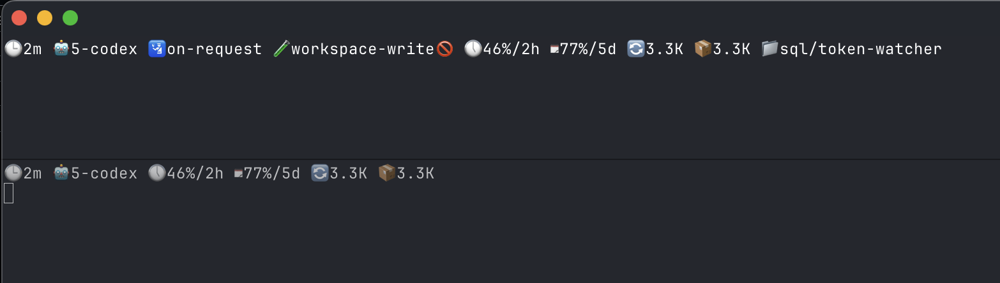

# codex-status

`codex-status` is a small CLI that reads Codex session rollout logs and prints a compact status line you can keep running in a terminal tab. It was originally built with help from OpenAI Codex and is now released for the community with limited, best-effort support.

## Features
- Displays the most recent Codex session summary, including model, sandbox policy, rate limits, and token usage.
- Watch mode refreshes the display on an interval without cluttering your terminal history.
- Output automatically trims to your terminal width for clean presentation.

## Output Example



## Installation

### Requirements
- Node.js 18 or newer
- Codex CLI (`@openai/codex`) version 0.41.0 or later. Install with `npm install -g @openai/codex` or follow the official guide at [github.com/openai/codex](https://github.com/openai/codex).

### npm
```bash
npm install -g codex-status
# or run ad-hoc
npx codex-status --help
```

### Homebrew
A Homebrew formula is provided under `HomebrewFormula/codex-status.rb`. Once published, users can install via:
```bash
brew tap clockworknet/codex-status https://github.com/clockworknet/codex-status
brew install codex-status
```
After each release, update the formula with the new version number and tarball checksum (see Maintenance).

## Usage
```bash
codex-status             # show the most recent session summary
codex-status --watch     # refresh every 15 seconds (default)
codex-status --watch -n 5  # refresh every 5 seconds
codex-status --limit 3   # display the three most recent sessions
codex-status --base ~/custom/path  # override the rollout log directory
codex-status --minimal   # hide policy and directory fields for tighter output
codex-status --version   # print version information
```
Use `codex-status --help` for the full option list.

## Maintenance
1. Bump the version in `package.json`.
2. Regenerate the npm package (`npm publish`).
3. Create a GitHub release tagged as `vX.Y.Z`.
4. Update `HomebrewFormula/codex-status.rb` with the new version and release tarball SHA256.
5. Commit and push the changes, then update the tap (`brew tap --repair clockworknet/codex-status`).

## Support Policy
This project is provided as-is with limited support. Please file issues on GitHub and we will respond on a best-effort basis.

## Acknowledgements
Built with assistance from OpenAI Codex and the broader open-source community.
